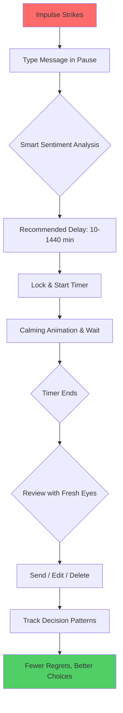

# ⏸️ Pause

> A mindful delay between impulse and action

[](https://github.com/Aliriyaj007/Pause/stargazers)
[](https://github.com/Aliriyaj007/Pause/network)
[](https://opensource.org/licenses/MIT)
[](https://github.com/Aliriyaj007/Pause)
[](https://github.com/Aliriyaj007/Pause)

## 🎯 What Problem Does This Solve?

**Before Pause:**
```
Impulse → Immediate Action → Potential Regret
```

**After Pause:**
```
Impulse → Intentional Delay → Conscious Choice → Minimal Regret
```

This tool creates space between emotional spikes and digital actions. It's not about suppressing emotion—it's about giving reason time to catch up.

## ✨ Key Features

| Feature | Description | Why It Matters |
|---------|-------------|----------------|
| **Zero Data Collection** | Everything stays on your device | Your private thoughts never leave your browser |
| **7 Premium Themes** | Light, Dark, OLED, Sunset, and more | Visual comfort for every mood and environment |
| **Smart Sentiment Detection** | Client-side text analysis | Recommends appropriate delay times automatically |
| **Cross-Platform** | Works on desktop, tablet, mobile | Consistent experience everywhere |
| **Export/Import** | Full data backup to JSON | Complete control over your data |
| **No Dependencies** | Single HTML file | Runs anywhere, instantly |

## 🚀 Get Started in 60 Seconds

### **Option 1: Use Online (Easiest)**
Simply visit: **[https://aliriyaj007.github.io/Pause/](https://aliriyaj007.github.io/Pause/)**

### **Option 2: Download & Run Locally**
```bash
# Download the single HTML file
curl -O https://aliriyaj007.github.io/Pause/index.html

# Or use wget
wget https://aliriyaj007.github.io/Pause/index.html

# Open in your browser
open index.html  # macOS
start index.html # Windows
xdg-open index.html # Linux
```

### **Option 3: Clone the Repository**
```bash
git clone https://github.com/Aliriyaj007/Pause.git
cd Pause
open index.html
```

## 📱 How It Works



## 🎨 The Complete Experience

### **Core Workflow**
1. **Capture** - Write your impulsive thought (angry email, purchase, social post)
2. **Delay** - Set wait time (10 minutes to 24 hours)
3. **Lock** - Secure it with one click
4. **Wait** - Watch calming animation, receive mindfulness prompts
5. **Decide** - Review with perspective, choose wisely

### **Premium Features**
| Category | Features |
|----------|----------|
| **Visual** | 7 themes, particle animations, dark mode |
| **Behavioral** | Sentiment analysis, delay recommendations, statistics |
| **Productivity** | Quick tools, mood checks, breathing guides |
| **Privacy** | Local storage only, export/import, no tracking |
| **Accessibility** | Responsive design, font sizing, keyboard shortcuts |

## 📊 Real-World Impact

### **Use Cases**
| Scenario | Without Pause | With Pause |
|----------|---------------|------------|
| **Angry Email** | Sent immediately → Damaged relationships | Delayed 30 min → Calm revision → Professional response |
| **Impulse Purchase** | Bought instantly → Buyer's remorse | Delayed 2 hours → Reason prevails → Money saved |
| **Social Media Post** | Posted in emotion → Public embarrassment | Delayed 1 hour → Edited → Maintained reputation |
| **Critical Message** | Sent without review → Misunderstanding | Delayed 10 min → Proofread → Clear communication |

### **Statistics You Can Track**
- Total pauses created
- Release vs. send ratio
- Average delay time
- Emotional pattern recognition

## 🛠️ For Developers

### **Technical Architecture**
```
pause.html
├── CSS (Embedded)
│   ├── 7 Theme System
│   ├── Responsive Design
│   └── Animations
├── JavaScript (Modular)
│   ├── State Management
│   ├── UI Controller
│   ├── Theme Manager
│   └── Utilities
└── No External Dependencies
```

### **Key Technical Decisions**
- **Single HTML File** - Zero installation, maximum portability
- **No Frameworks** - Vanilla JS for performance and transparency
- **LocalStorage Only** - Absolute privacy guarantee
- **Service Worker Ready** - Progressive Web App capabilities
- **Accessibility First** - Semantic HTML, ARIA labels, keyboard nav

### **Browser Compatibility**
| Browser | Status | Notes |
|---------|--------|-------|
| Chrome 60+ | ✅ Full support | Recommended |
| Firefox 55+ | ✅ Full support | |
| Safari 11+ | ✅ Full support | |
| Edge 79+ | ✅ Full support | |
| Mobile Browsers | ✅ Full support | Responsive design |

## 🤝 Contributing

This project proves its value by existing. If it helps you, consider helping it grow.

### **Ways to Contribute**
1. **Use It** - The best contribution is genuine usage
2. **Report Issues** - Found a bug? Open an issue
3. **Suggest Features** - Have an idea? Share it
4. **Improve Documentation** - Clarify, translate, enhance
5. **Share** - Tell someone who needs it

### **Development Setup**
```bash
# 1. Fork the repository
# 2. Clone your fork
git clone https://github.com/your-username/Pause.git

# 3. Make changes
# 4. Test locally (just open index.html)
# 5. Submit a pull request
```

**Contribution Philosophy:** Small, focused improvements over major rewrites. Every thoughtful contribution matters.

## 📝 License

MIT License - see [LICENSE](LICENSE) file for details.

**In plain English:** Use it, modify it, distribute it. Just give credit. No warranty.

## 👤 Author & Contact

**Riyajul Ali**  
Building tools that create space for better decisions.

- **GitHub**: [https://github.com/Aliriyaj007](https://github.com/Aliriyaj007)
- **Email**: [aliriyaj007@protonmail.com](mailto:aliriyaj007@protonmail.com)
- **LinkedIn**: [linkedin.com/in/Aliriyaj007](https://linkedin.com/in/Aliriyaj007)

### **Direct Links**
- 🌐 **Web App**: [https://aliriyaj007.github.io/Pause/](https://aliriyaj007.github.io/Pause/)
- 📥 **Download**: [Direct Download](https://aliriyaj007.github.io/Pause/index.html)
- 🐛 **Issues**: [GitHub Issues](https://github.com/Aliriyaj007/Pause/issues)

## 🌟 Why This Project Lasts

1. **Solves a timeless problem** - Human emotion hasn't evolved; digital impulsivity has exploded
2. **Respects user sovereignty** - No accounts, no tracking, no data collection
3. **Technical simplicity** - Single file, zero dependencies, runs everywhere
4. **Visual polish** - Professional design that respects user attention
5. **Open transparency** - Every line of code visible and understandable

---

**Final Thought:** In a world optimized for instant reaction, this tool defends your right to thoughtful response. It doesn't just save you from regret—it creates space for your best self to show up.

*Star if you find it useful. Fork if you want to make it yours. Share if you know someone who needs it.*
